<div align="center">

# ◆ SOC_BOT

### One video. One caption. One cover. **Every account.**

A terminal app that publishes a finished video to **many Instagram, YouTube and TikTok accounts at once**,
with official APIs only. No passwords, no scraping, no browser automation.

<p>
  
  
  
  
  
  
  
</p>

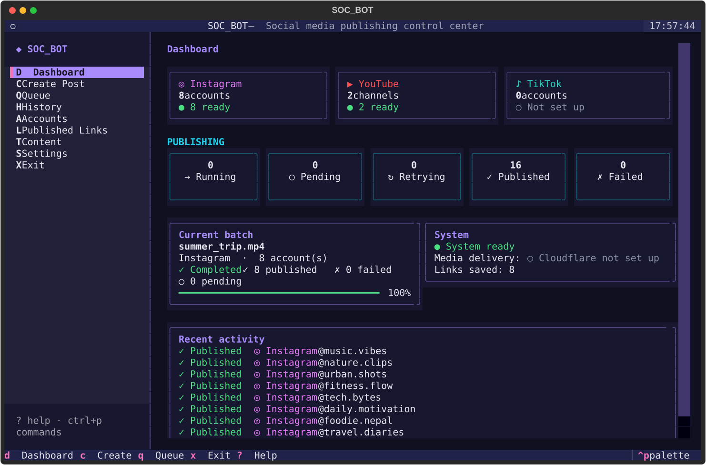

<sub>All screenshots use demo accounts and demo files.</sub>

</div>

---

## ✨ What it does

<table>
<tr>
<td width="33%" valign="top">

### 🎯 One post, many accounts
Pick one video, one caption and one optional cover, tick as many accounts as you like, and confirm
**once**. Every account becomes its own independent job, so one failure never blocks the others.

</td>
<td width="33%" valign="top">

### ⚡ 5 at a time, automatically
Instagram jobs run **5 in parallel**, and the next one starts as soon as a slot frees up. Accounts that
failed get **one automatic retry** at the end.

</td>
<td width="33%" valign="top">

### 🖼️ Same cover everywhere
One `cover.jpg` is used for **every** selected Instagram account (and as the YouTube thumbnail). This
was verified on real Reels.

</td>
</tr>
<tr>
<td valign="top">

### 🚀 Big videos, no cloud upload
Large videos are served straight from your PC through **one** temporary Cloudflare Quick Tunnel per
batch. Nothing is uploaded to cloud storage. Tested with 131.9 MB videos.

</td>
<td valign="top">

### 🔗 Links saved automatically
Every published Reel and video link is saved to `content/published_links/*.json` and `.txt`, ready to
copy with one key press.

</td>
<td valign="top">

### 🔐 Private by design
Official OAuth only. Tokens are **encrypted** locally. Temporary URLs and secrets are never stored or
logged.

</td>
</tr>
</table>

**What it deliberately does NOT do:** AI video/caption generation · scraping or browser automation ·
fake engagement · account creation · password logins · unofficial APIs.

---

## 🧭 How it works

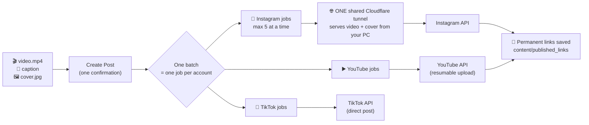

### An Instagram batch, step by step

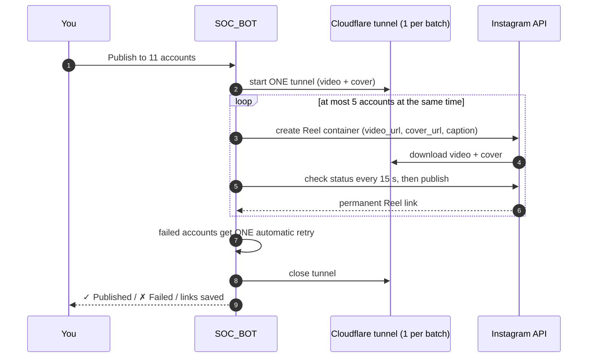

### Job lifecycle

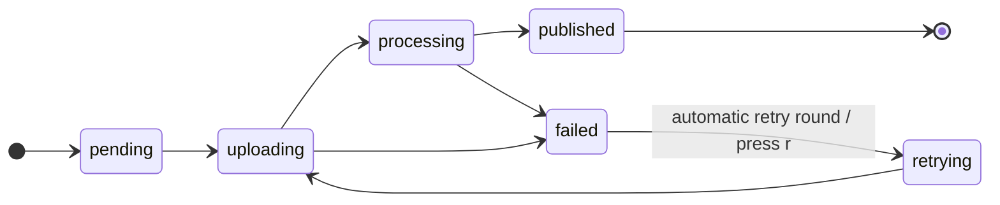

---

## 🖥️ Screenshots

<table>
<tr>
<td align="center">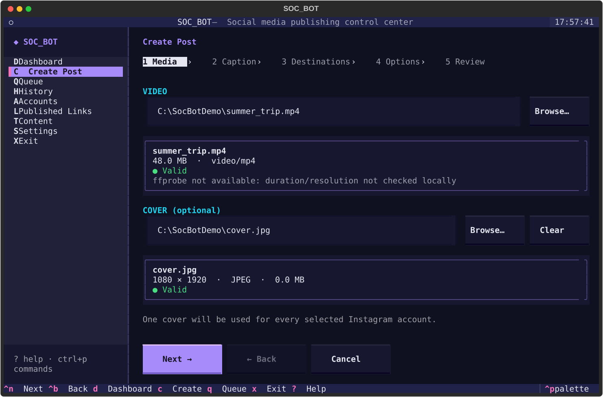<br><b>1 · Media:</b> one video and one optional cover</td>
<td align="center">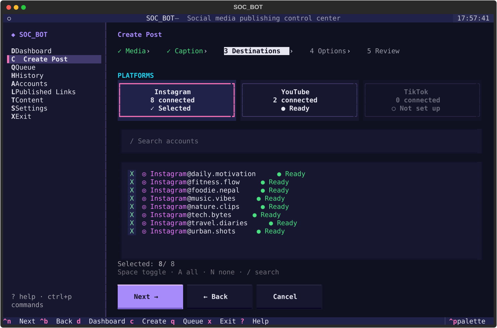<br><b>2 · Destinations:</b> search, select all, toggle</td>
</tr>
<tr>
<td align="center">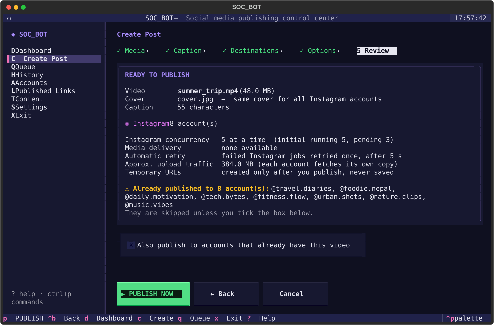<br><b>3 · Review:</b> one summary, one confirmation</td>
<td align="center">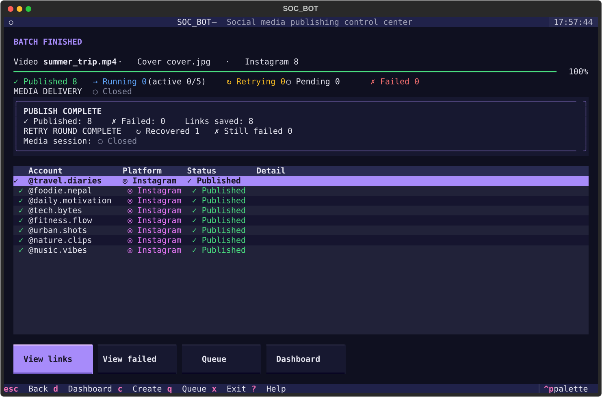<br><b>4 · Live publishing:</b> retry round and final result</td>
</tr>
<tr>
<td align="center">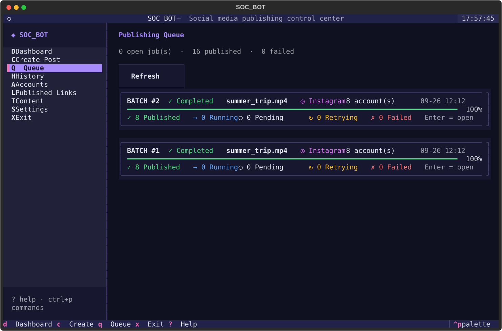<br><b>Queue:</b> every batch with its progress</td>
<td align="center">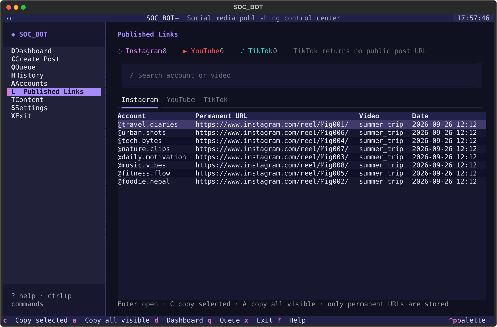<br><b>Published Links:</b> copy one or all</td>
</tr>
<tr>
<td align="center" colspan="2">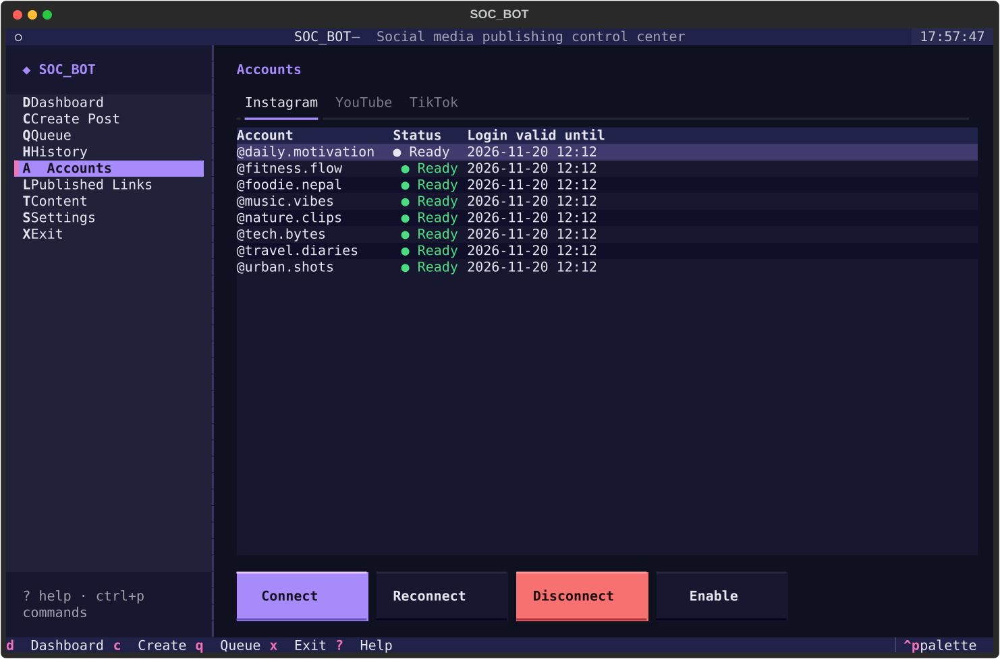<br><b>Accounts:</b> connect, reconnect, disconnect</td>
</tr>
</table>

---

## 🚀 Quick start

> **New computer? Follow the step-by-step guides in [`setup_guide/`](setup_guide/).**
> They explain every click, from installing Python to connecting each account.

| Step | Guide |
|---|---|
| 1. Install Python, Git, `cloudflared` and Soc_bot, then create `.env` | [`00_MASTER_SETUP_GUIDE.md`](setup_guide/00_MASTER_SETUP_GUIDE.md) |
| 2. Create the Instagram app and connect every Instagram account | [`01_INSTAGRAM_SETUP.md`](setup_guide/01_INSTAGRAM_SETUP.md) |
| 3. Set up YouTube (Google Cloud) and connect every channel | [`02_YOUTUBE_SETUP.md`](setup_guide/02_YOUTUBE_SETUP.md) |
| 4. Create the TikTok developer app and connect | [`03_TIKTOK_SETUP.md`](setup_guide/03_TIKTOK_SETUP.md) |

Short version (Windows):

```powershell
git clone https://github.com/ayushrijal83-ops/Soc_bot.git
cd Soc_bot
pip install -r requirements.txt
winget install --id Cloudflare.cloudflared      # needed for Instagram videos
Copy-Item .env.example .env                     # then fill it in (see the master guide)
```

Then **double-click `Start_Soc_bot.bat`** (or the **SOC_BOT** desktop shortcut). It opens the project
folder, installs any missing libraries on the first run and starts the app, so there is nothing to type.

From a terminal instead:

```powershell
python main.py            # full-screen terminal app
python main.py --plain    # classic text menu
python main.py --dry-run  # show what would be published, publish nothing
python main.py --scan     # publish ready Content Inbox packages (AUTO profiles)
```

> **⚠️ Never commit `.env`.** It holds your app secrets and the token encryption key, and it is git-ignored.

---

## ⌨️ Keyboard

| Key | Page | | Key | Action |
|:---:|---|---|:---:|---|
| **D** | Dashboard | | **/** | Search |
| **C** | Create Post | | **Space** | Tick / untick |
| **Q** | Queue | | **Enter** | Open / confirm |
| **H** | History | | **Esc** | Back |
| **A** | Accounts | | **P** | Publish (on Review) |
| **L** | Published Links | | **Del** | Delete history (on History) |
| **T** | Content | | **Ctrl+P** | Command palette |
| **S** | Settings | | **?** / **X** | Help / Exit |

In **Queue**, open a batch to use **o** (open the post), **c** (copy the link) and **r** (retry a failed job).
In **Links**, **C** copies the selected link and **A** copies all visible links.
Every page works down to 80×24. Below 100 columns the sidebar hides.

---

## 📊 Platform support

| | Instagram | YouTube | TikTok |
|---|:---:|:---:|:---:|
| Connect accounts (official OAuth) | ✅ | ✅ | ✅ |
| Add many accounts (fresh login each time) | ✅ | ✅ | ✅ |
| Publish video | ✅ Reels | ✅ | ✅ Direct Post |
| Custom cover | ✅ `cover_url` | ✅ thumbnail | ➖ not offered by the API |
| Many accounts in one batch | ✅ 5 at a time | ✅ | ✅ |
| Automatic retry round | ✅ | ➖ manual retry (**r**) | ➖ manual retry (**r**) |
| Permanent link saved | ✅ | ✅ | ➖ no public URL for private posts |
| Tested against the real platform | ✅ 11 accounts | ✅ 2 channels | ⏳ waiting for developer credentials |

---

## 📥 Content Inbox (optional)

Drop finished posts into folders and publish them from the **Content** page, or automatically with `--scan`:

```
content/incoming/post_001/
    video.mp4        one video (.mp4 / .mov / .webm)
    caption.txt      UTF-8 caption, sent as-is
    cover.jpg        optional cover (Instagram Reel cover / YouTube thumbnail)
    title.txt        optional YouTube title
```

Full guide: [docs/CONTENT_INTAKE.md](docs/CONTENT_INTAKE.md).

---

## 🗂️ Project layout

```
Soc_bot/
├── Start_Soc_bot.bat        ← double-click to start
├── main.py                  ← entry point (TUI, --plain, --dry-run, --scan)
├── setup_guide/             ← step-by-step setup for a new computer
├── src/
│   ├── tui/                 ← terminal UI (Textual): screens, theme, widgets
│   ├── services/            ← thin layer the UI uses (plan / publish / accounts / links)
│   ├── core/                ← publishing engine, jobs, retries, published links
│   ├── platforms/           ← Instagram / YouTube / TikTok adapters (official APIs)
│   ├── media_storage/       ← shared media session, Cloudflare tunnel, temp hosting
│   ├── auth/                ← OAuth, callback server, token refresh
│   └── storage/             ← SQLite database + migrations (encrypted tokens)
├── content/                 ← drop folders and published links (not in git)
├── docs/                    ← architecture, API notes, troubleshooting, decisions
└── tests/                   ← 800+ automated tests
```

---

## 📚 Documentation

| Document | For |
|---|---|
| [setup_guide/](setup_guide/) | Installing and connecting everything, step by step |
| [docs/PROJECT_STATUS.md](docs/PROJECT_STATUS.md) | What's done, verified and still open |
| [docs/ARCHITECTURE.md](docs/ARCHITECTURE.md) | How the pieces fit together |
| [docs/API_INTEGRATIONS.md](docs/API_INTEGRATIONS.md) | Exact platform API behavior and limits |
| [docs/AUTHENTICATION.md](docs/AUTHENTICATION.md) | OAuth flows and token handling |
| [docs/CONTENT_INTAKE.md](docs/CONTENT_INTAKE.md) | Drop-folder publishing, covers, published links |
| [docs/DATABASE.md](docs/DATABASE.md) | Schema and migrations |
| [docs/TROUBLESHOOTING.md](docs/TROUBLESHOOTING.md) | Error messages and fixes |
| [docs/SECURITY.md](docs/SECURITY.md) | Tokens, secrets, what is stored |
| [docs/DEVELOPMENT.md](docs/DEVELOPMENT.md) | Developer setup, tests, TUI structure, screenshots |
| [docs/TESTING.md](docs/TESTING.md) | Test strategy |
| [docs/DECISIONS.md](docs/DECISIONS.md) | Why things are built the way they are |
| [docs/CLAUDE_HANDOFF.md](docs/CLAUDE_HANDOFF.md) | Handoff notes for AI assistants |

---

## 🔐 Security

- Only **official** OAuth flows are used. Soc_bot never sees or stores your passwords.
- Tokens are **encrypted** (Fernet) in a local SQLite database, and the key lives only in your `.env`.
- Temporary media URLs, tokens and secrets are **never** saved or logged.
- The local media server listens on `127.0.0.1` only and serves just the prepared video and cover.
- `.env`, `data/`, `content/`, `videos/` and the logs are git-ignored.

---

<div align="center">

MIT License · see [LICENSE](LICENSE)

</div>
